# Dify插件配置

用于接入 Dify AI 对话能力的功能模块。

```toml
# plugins/Dify/config.toml
[Dify]
enable = true                           # 是否启用此功能
api-key = ""                           # Dify的API Key，必填
base-url = "https://api.dify.ai/v1"    # Dify API接口地址

# 支持的指令列表
commands = ["ai", "dify", "聊天", "AI"]

# 指令提示信息
command-tip = """-----XYBot-----
💬AI聊天指令：
聊天 请求内容
"""

# 其他插件的指令，避免冲突
other-plugin-cmd = ["status", "bot", ...]  # 其他插件指令列表

price = 0              # 每次使用扣除的积分，0表示不扣除
admin_ignore = true    # 管理员是否忽略积分扣除
whitelist_ignore = true # 白名单用户是否忽略积分扣除

# Http代理设置
# 格式: http://用户名:密码@代理地址:代理端口
# 例如：http://127.0.0.1:7890
http-proxy = ""
```

### 配置说明

1. 基础配置

- `enable`: 是否启用Dify插件
- `api-key`: Dify平台的API密钥，必须填写
- `base-url`: Dify API的接口地址，默认为 https://api.dify.ai/v1

2. 指令配置

- `commands`: 支持的指令列表，可以添加多个指令
- `command-tip`: 指令提示信息，可以自定义
- `other-plugin-cmd`: 其他插件的指令，避免冲突

3. 积分配置

- `price`: 每次使用扣除的积分，0表示不扣除
- `admin_ignore`: 管理员是否忽略积分扣除
- `whitelist_ignore`: 白名单用户是否忽略积分扣除

4. 代理配置

- `http-proxy`: Http代理设置(可选)

### 使用示例

1. 基础对话
   `帮我写一首诗`

2. 群聊中使用
   `@机器人 今天心情不好`

### 注意事项

- API密钥不要泄露
- 建议配置代理以提高访问稳定性
- 合理设置积分规则，避免滥用

### 获取API密钥方法

1. 登录 [Dify](https://dify.ai/) 平台
2. 创建或选择一个应用
    - 可导入本项目提供的 [Dify应用模版](https://github.com/HenryXiaoYang/XYBotV2/blob/main/XYBot_Dify_Template.yml)
    - 可配置使用的AI模型
3. 在左侧导航栏找到"访问API"
4. 创建新的API密钥
5. 将获得的密钥填入配置文件的 api-key 字段

Dify相关信息：

- Dify官方文档: https://docs.dify.ai/zh-hans
- CSDN的教程：https://blog.csdn.net/2301_81940605/article/details/143730438
- 学会使用搜索引擎: https://www.bing.com/search?q=Dify+API+新手教程
- 学会使用搜索引擎: https://www.google.com/search?q=Dify+API+新手教程
- 学会使用Github: https://github.com/langgenius/dify

# Dify

## 什么是 Dify？

Dify 是一个开源的大语言模型（LLM）应用开发平台，旨在帮助开发者快速构建和部署 AI 应用。它提供了强大的 API
接口，支持多种模型的接入和使用，适合各种场景的应用开发。

## 如何配置Dify

### 步骤 1：访问 Dify 网站

1. 打开浏览器，访问 [Dify 官方网站](https://dify.ai/zh)。
2. 点击右上角的"开始使用"按钮，输入你的账号信息进行登录。如果没有账号，请先注册。

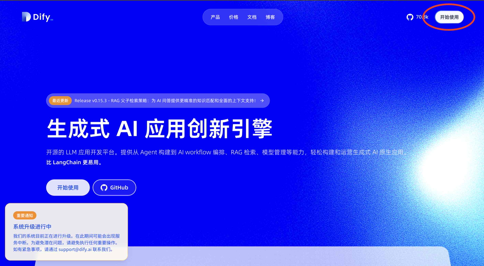

### 步骤 2：创建应用

1. 登录后，在控制面板中选择"导入DSL文件"。
2. 把`https://github.com/HenryXiaoYang/XYBotV2/blob/main/XYBot_Dify_Template.yml`下载下来，导入到Dify中。

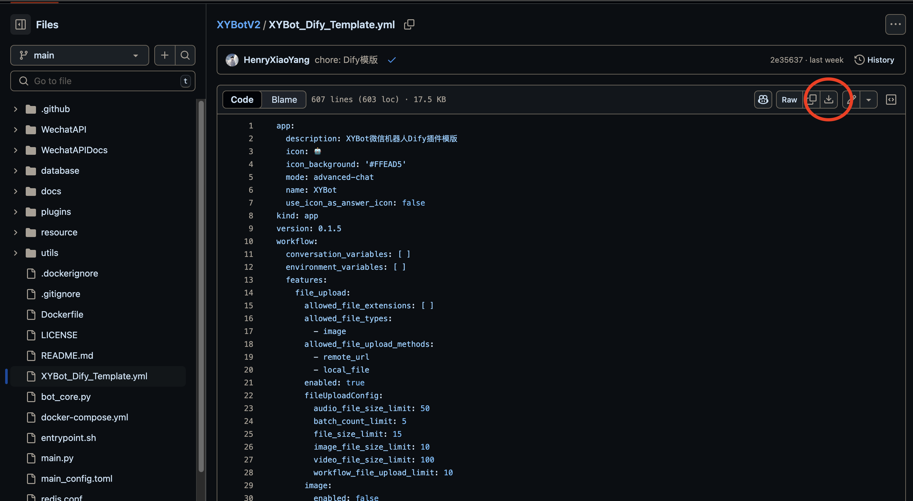

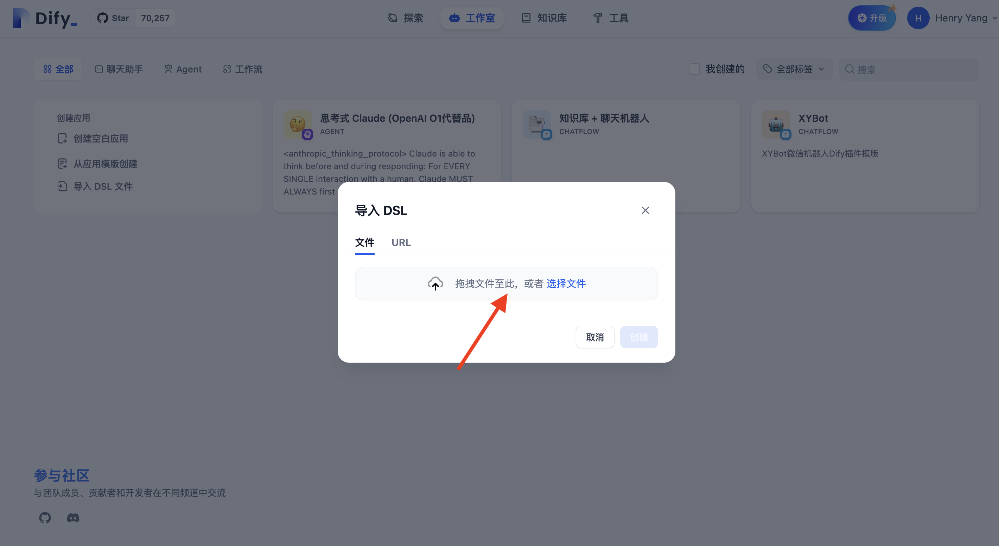

3. 点击"创建"按钮。

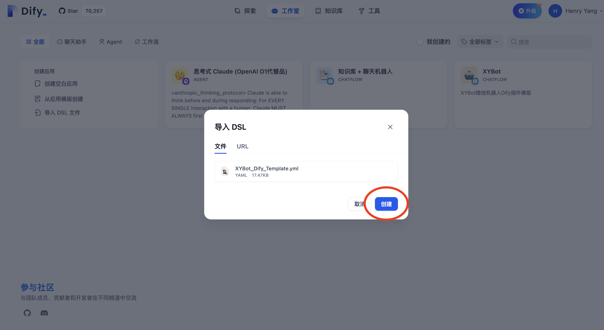

### 步骤 3：获取 API 密钥

1. 在应用创建成功后，会进入应用设置页面。
2. 找到左侧栏"访问API"选项，点击进入。

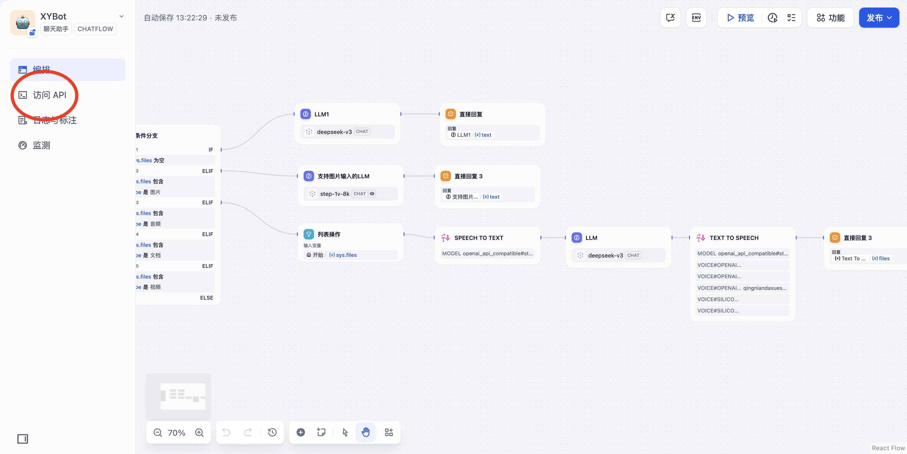

3. 保存API服务器网址，然后点击右上角"API 密钥"

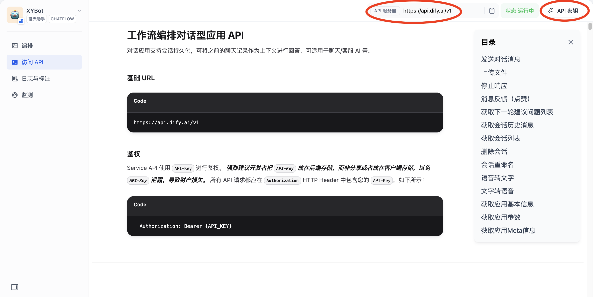

4. 点击"创建密钥"
   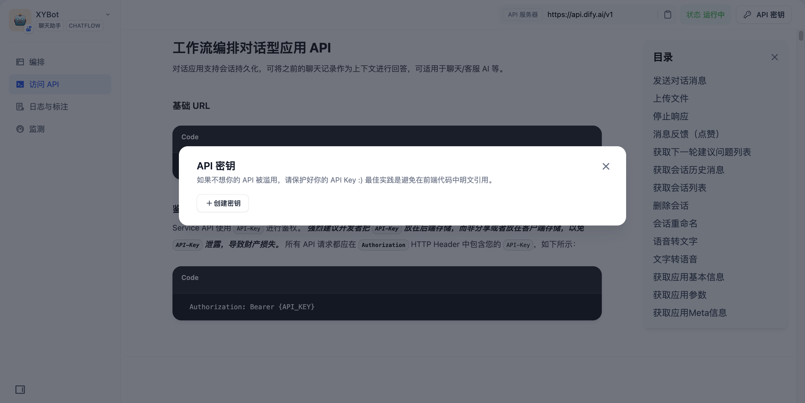

5. 请妥善保存密钥

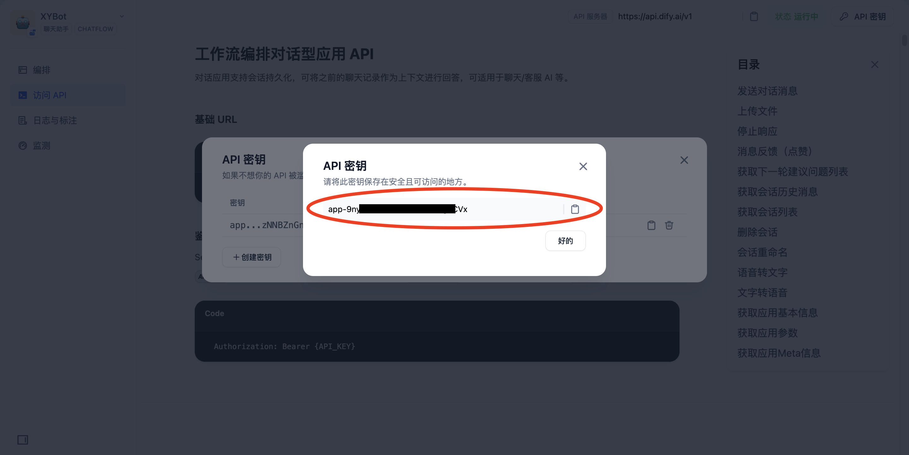

### 步骤 4：配置模型供应商

1. 点击右上角你的用户名，再点击"设置"

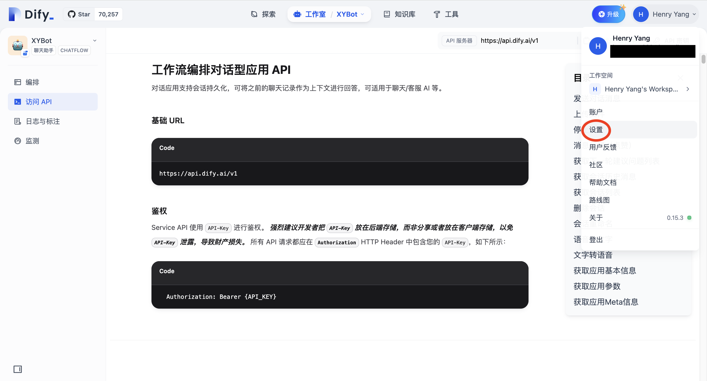

2. 点击"模型供应商"

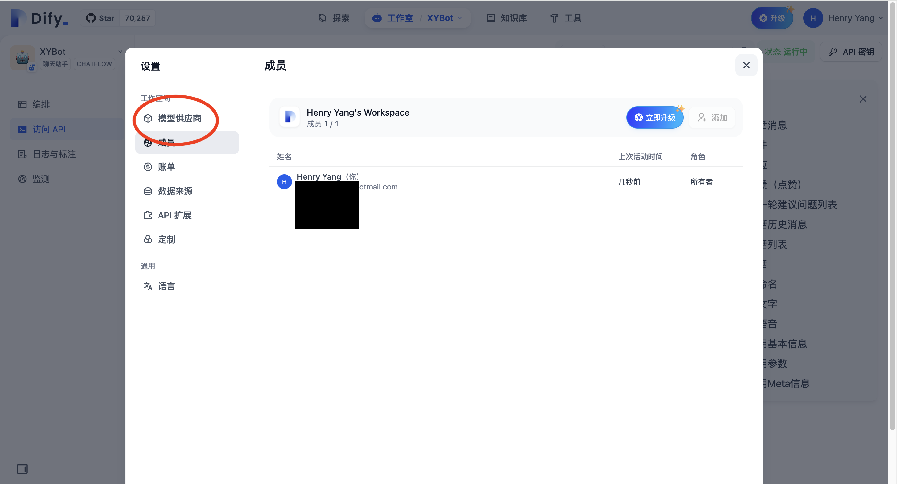

3. 按需求配置模型

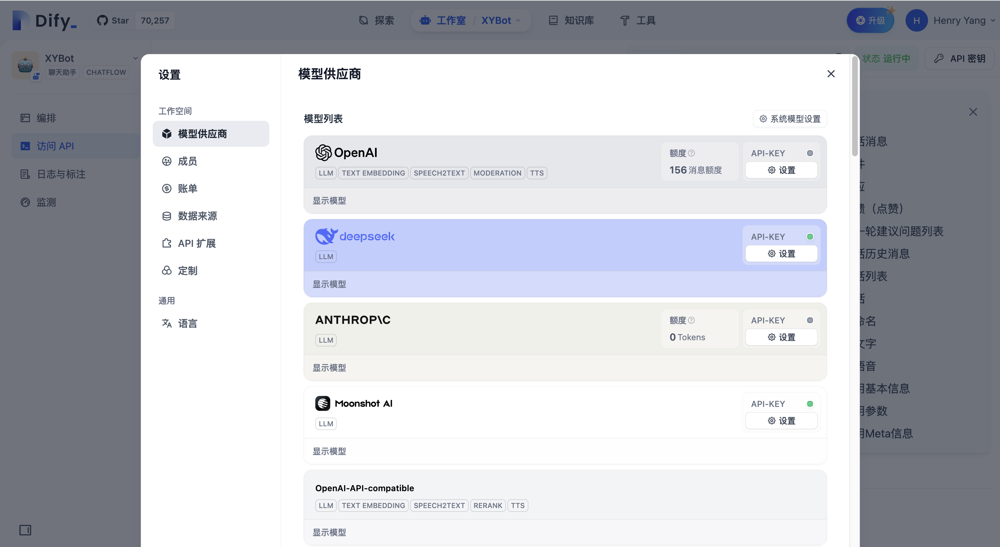

- 技巧：配置OpenAIAPI格式的模型

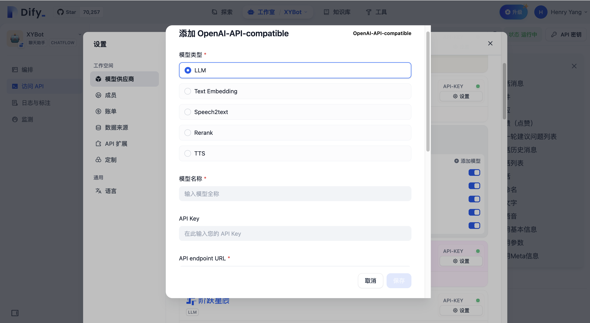

如果模型服务不在Dify默认支持服务中，并且模型服务有OpenAI格式的API服务，那么可以使用`OpenAI-API-compatible`让Dify适配OpenAI
API。

### 步骤 5：配置编排

1. 点击左侧栏"编排"选项

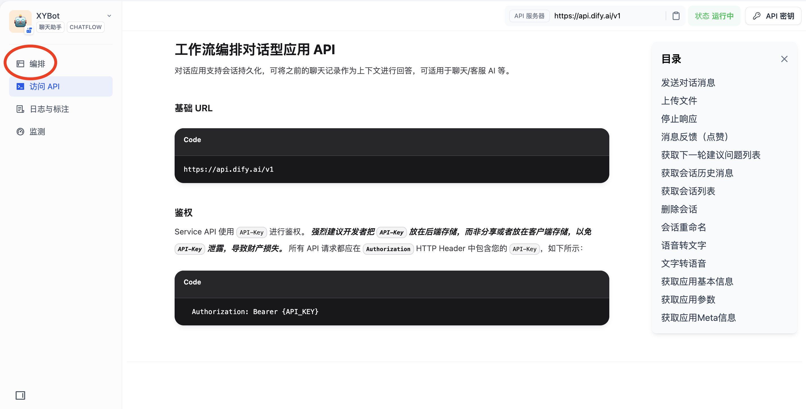

2. 有三个LLM节点需要配置

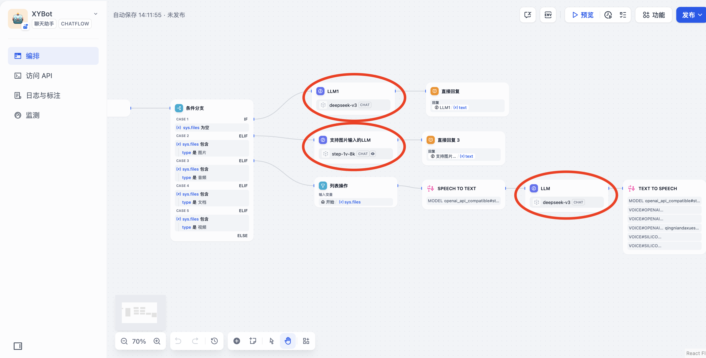

3. 点击一个节点，在选择右边栏的模型

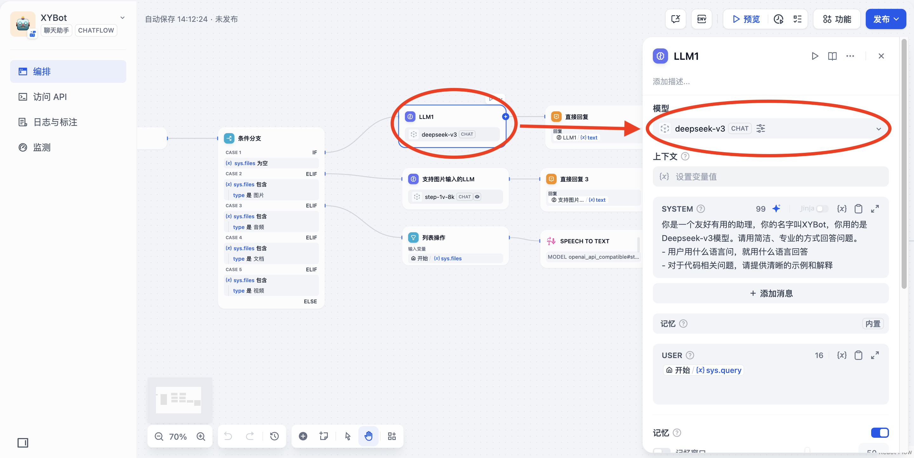

4. 选择一个合适的模型

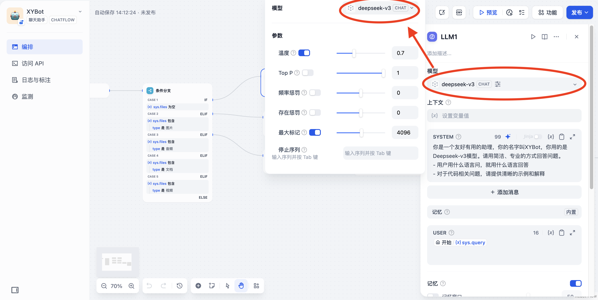

- 注意，这个节点选择的模型需要支持图片输入

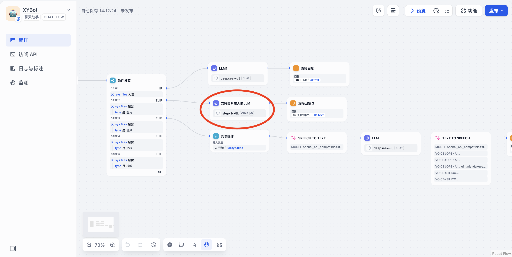

## 步骤 6: 发布

1. 点击右上角"发布"，再点一次"发布"

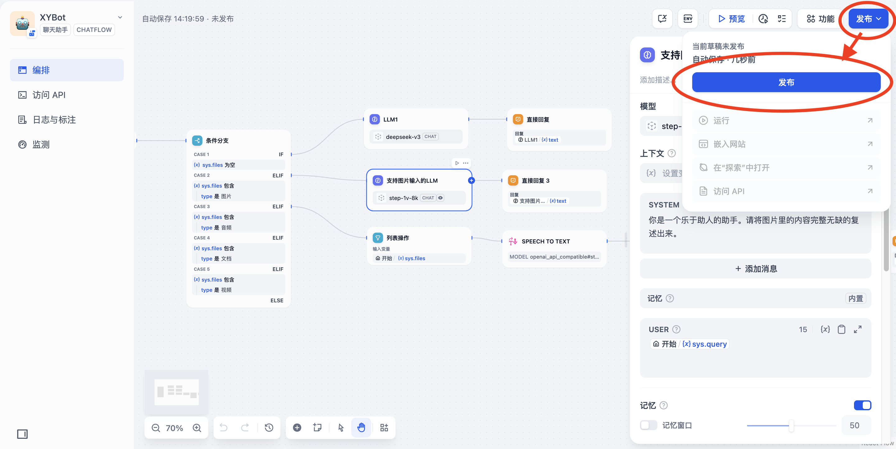

## 步骤 7: 配置XYBot

1. 回到XYBot项目，在`plugins/Dify/config.toml`文件中写入你保存的API网址和密钥。

```toml
# plugins/Dify/config.toml
[Dify]
enable = true
api-key = ""   # 写入你保存的API密钥
base-url = "https://api.dify.ai/v1" # 写入你保存的API网址

#...下面略...#
```

2. 保存文件，重载Dify插件

## 参考链接

- [Dify 官方文档](https://docs.dify.ai/zh-hans)
- [模型配置指南](https://docs.dify.ai/zh-hans/guides/model-configuration)
- [工作流指南](https://docs.dify.ai/zh-hans/guides/workflow)
- [API 开发指南](https://docs.dify.ai/zh-hans/guides/application-publishing/developing-with-apis)